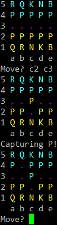

# chvss
Super simple 5x5 python chess game. The home rank will be randomized for each player. Requires a color terminal. 

To move, specify the file and rank for both the starting and ending positions. Therefore, to move the C file pawn, you would enter "c2 c3".

TODO:
1. Improve move input format to allow: "pc2" for "Pawn to C2"
2. Improve computer move scoring
